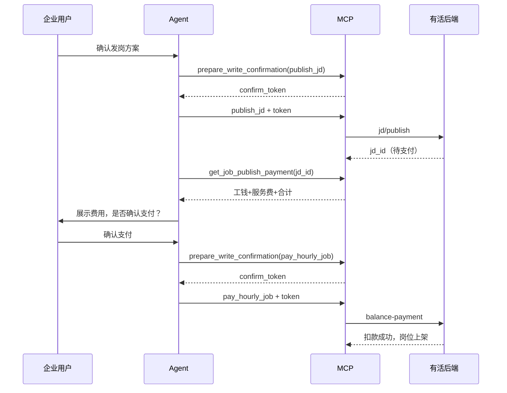
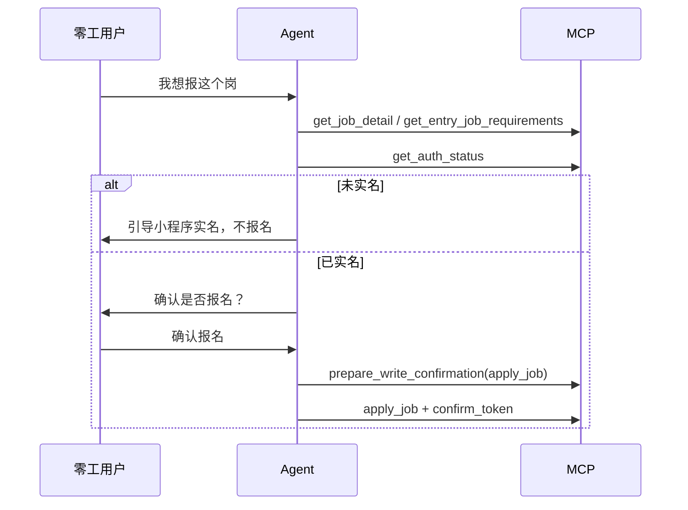

# 有活 MCP 产品培训手册

> **适用对象**：内部产品、运营、测试、售前  
> **版本**：2026-06  
> **环境**：测试网关 `hopped-gateway-service-sops-test.hopped.com.cn`

---

## 一、整体架构

```
用户对话
   │
   ▼
Skill 层（行为规则 / SOP）
   job-planner          → B 端招工（发岗、众包）
   workforce-dispatcher → B 端调度（筛人、考勤、结算）
   job-seeker           → C 端找活（搜索、报名、提现）
   │
   ▼
MCP Server 层（Tool 调用 + 安全门禁）
   youhuo-b-api  （role=2 招工方）
   youhuo-c-api  （role=1 找活方）
   │
   ▼
有活后端 API（小程序同一套接口）
```

| 组件 | 作用 |
|:---|:---|
| **Skill** | 规定 Agent「该怎么问、怎么展示、何时才能写操作」 |
| **MCP Tool** | 实际调用后端接口；写操作带硬门禁 |
| **confirm_token** | 防 Agent 擅自执行扣款/发布/报名等敏感操作 |

**AI 明确不做的事**：代充值、代拉起微信支付、虚构用户未提供的信息、批量自动处理敏感写操作。

---

## 二、通用流程：扫码授权

B/C 端共用逻辑，Server 不同。

| 步骤 | B 端 `youhuo-b-api` | C 端 `youhuo-c-api` |
|:---:|:---|:---|
| 1 | `create_auth_session()` | `create_auth_session()` |
| 2 | 展示二维码，用户微信扫码 | 同左 |
| 3 | `check_auth_status(session_id)` 直到 `authorized` | 同左 |
| 4 | `get_current_user_info()` 确认身份 | 同左 |

**示例对话（B 端）**

```
用户：帮我发个小时工
Agent：请先扫码授权招工方账号。
       [展示 create_auth_session 返回的二维码]
用户：[微信扫码完成]
Agent：check_auth_status → 已授权，石海波，个人招工。请问岗位地点和班次？
```

---

## 三、写操作安全模型（必读）

### 3.1 操作分级

| 级别 | 含义 | Agent 行为 |
|:---|:---|:---|
| **R0 只读** | 查询，不改数据 | 直接调用 |
| **R1 写操作** | 改状态，不直接扣款 | 用户确认 + 门禁 |
| **R2 支付/扣款** | 发布、支付、结算、提现 | 费用展示 + 双重确认 + 门禁 |

### 3.2 B 端：两阶段 confirm_token（默认开启）

所有 B 端写 Tool 均须：

```
阶段一  prepare_write_confirmation(tool_name, params_json, preview_summary)
        → 返回 confirm_token（约 5 分钟有效，一次性）

阶段二  写Tool(..., user_confirmed=true, confirm_token=..., confirmation_summary=...)
        → 校验 token 与参数一致 → 执行
```

| 错误码 | 含义 |
|:---|:---|
| `CONFIRMATION_REQUIRED` | 未传 `user_confirmed=true` |
| `CONFIRM_TOKEN_REQUIRED` | 未 prepare / token 过期 / 参数不一致 / token 已使用 |
| `WRITE_DISABLED` | 管理员关闭写模式 |

### 3.3 C 端：分级门禁

| 级别 | Tool | 门禁 |
|:---|:---|:---|
| **P0/P1** | `apply_job`、`withdraw_balance`、`cancel_apply`、`submit_job_registration`、`revoke_auth` | 两阶段 confirm_token |
| **P2** | `update_work_preferences`、简历类、候补类 | 仅 `user_confirmed=true` |

---

## 四、B 端 MCP（youhuo-b-api）

### 4.1 能力地图

| 场景 | 推荐 Skill | 核心 Tool |
|:---|:---|:---|
| 发岗位、发众包 | job-planner | `publish_jd`、`pay_hourly_job`、`pay_publish_points`、`publish_task` |
| 看报名、筛人、考勤 | workforce-dispatcher | `get_job_workers`、`mark_worker_suitable`、`get_todo_list` |
| 结算、发票 | workforce-dispatcher / job-planner | `pay_schedule_settlement`、`manage_invoice(action=apply)` |
| 查余额 | job-planner | `get_enterprise_finance(sections=balance)` |

**完整 Tool 清单**见 [`mcp-servers/README.md`](../README.md)。

---

### 4.2 流程 A：发布小时工（productType=4）

> **与小程序一致**：`publish` 只创建岗位；**支付是独立一步**，用户确认后才扣余额。



**示例对话**

```
用户：百子湾招 1 个咖啡师小时工，明天 14-18 点，10 元/时

Agent：[只读] get_recruit_addresses / preview_publish_cost / get_enterprise_balance
       「方案：MCP测试小时工--咖啡师，百子湾，10元/时，1人，6/25 14:00-18:00
        当前个人余额 ¥384.22。确认创建岗位吗？」

用户：确认

Agent：[写①] prepare_write_confirmation("publish_jd", params_json, ...)
       publish_jd(..., user_confirmed=true, confirm_token=...)
       → jd_id: 2938929，岗位已创建（尚未扣款）

       [只读] get_job_publish_payment(2938929)
       「待支付：工钱 ¥40 + 服务费 ¥2.81 = 合计 ¥42.81。确认支付并上架吗？」

用户：确认支付

Agent：[写②] prepare_write_confirmation("pay_hourly_job", {"job_id":2938929,...}, ...)
       pay_hourly_job(2938929, user_confirmed=true, confirm_token=...)
       → 扣款成功，岗位正式上架
```

**params_json 示例（publish_jd）**

```json
{
  "title": "MCP测试小时工--咖啡师",
  "work_category": "咖啡师",
  "description": "按标准制作饮品，维护吧台清洁",
  "location": "北京市朝阳区百子湾",
  "salary_min": 10,
  "salary_max": 10,
  "headcount": 1,
  "product_type": 4,
  "reference_job_id": 2938912,
  "recruit_address_id": 506,
  "work_category_id": 89,
  "position_type": 361,
  "template_id": 361,
  "job_date": "2026-06-25",
  "schedule_start": "14:00",
  "schedule_end": "18:00"
}
```

**params_json 示例（pay_hourly_job）**

```json
{
  "job_id": 2938929,
  "payment_type": 1
}
```

---

### 4.3 流程 B：发布计件工（productType=6）

与小时工相同三步链：

```
prepare → publish_jd → get_job_publish_payment → prepare → pay_hourly_job
```

计件工在支付接口中使用 `publishType=5`（由 MCP 内部根据岗位类型自动处理）。

---

### 4.4 流程 C：发布长期招（productType=2/5）

长期招用**积分订阅**，两步支付：

```
prepare → publish_jd        # 创建岗位，返回 jd_id
prepare → pay_publish_points(jd_id)  # 扣积分，岗位上架
```

**示例对话**

```
Agent：preview_publish_cost(2, 50人, 7天) → 175 积分（≈¥17.5）
       get_enterprise_balance → 积分 12656，充足
       「确认发布长期招岗位吗？」

用户：确认

Agent：prepare → publish_jd → jd_id=123456
       「岗位已创建，将扣 175 积分，确认支付吗？」

用户：确认支付积分

Agent：prepare → pay_publish_points(123456) → 岗位上架
```

---

### 4.5 流程 D：发布众包任务

```
[只读] get_task_categories / get_enterprise_balance / preview（预算）
用户确认
prepare → publish_task(..., user_confirmed=true, confirm_token=...)
```

众包为一次性写操作（发布即扣预算逻辑由后端处理），仍须两阶段 confirm_token。

---

### 4.6 流程 E：查看报名 / 筛选人员（workforce-dispatcher）

**只读为主，标记合适/不合适为写操作。**

```
get_job_list
  → get_job_workers(job_id)
  → 展示：姓名 + 评分 + 完成单量（不展示手机号）
  → 用户说「张三标记为合适」
  → prepare_write_confirmation("mark_worker_suitable", ...)
  → mark_worker_suitable(jd_id, user_id, mark=1, user_confirmed=true, confirm_token=...)
```

**示例对话**

```
用户：看看 2938929 有谁报名了

Agent：get_job_workers(2938929)
       「共 2 人报名：李四（评分 4.8，完成 32 单）…」

用户：把李四标记为合适

Agent：prepare → mark_worker_suitable(..., mark=1) → 成功
```

---

### 4.7 流程 F：待办 / 考勤处理

```
get_todo_list
  → get_schedule_detail_list(detail_id)
  → 展示零工、工时、金额
  → 用户确认处理方式
  → prepare → manage_attendance(action=refuse|add_time|delete_time, ...)
```

**示例：驳回考勤**

```
用户：驳回这条考勤，原因：打卡位置不符

Agent：prepare_write_confirmation("refuse_attendance",
         {"detail_id": 27841, "reason": "打卡位置不符"}, ...)
       refuse_attendance(27841, reason=..., user_confirmed=true, confirm_token=...)
```

---

### 4.8 流程 G：排班结算 / 发票 / 下线岗位

| 场景 | 流程 |
|:---|:---|
| 排班结算 | `get_schedule_detail_list` → 展示金额 → prepare → `pay_schedule_settlement` |
| 申请发票 | 展示开票信息表格 → prepare → `apply_invoice` |
| 停止招工 | prepare → `close_job(job_id, reason, ...)` |

**示例：下线岗位**

```
用户：下线岗位 2938929

Agent：prepare_write_confirmation("close_job", {"job_id":2938929,"reason":"测试完成"}, ...)
       close_job(2938929, user_confirmed=true, confirm_token=...)
       → 岗位已停止招工
```

---

### 4.9 B 端余额说明

| 字段 | 用途 |
|:---|:---|
| `points_balance` | 长期招积分 |
| `recharge_balance` / `primary_pay_balance` | 小时工/计件工发布支付、结算 |
| `trial_balance` | 体验金 |

余额不足时 MCP **硬拒绝**发布/支付，Agent 引导用户去小程序充值，**不代充值**。

---

## 五、C 端 MCP（youhuo-c-api）

### 5.1 能力地图

| 场景 | Skill | 核心 Tool |
|:---|:---|:---|
| 找活推荐 | job-seeker | `get_recommend_jobs`、`search_jobs` |
| 看详情、报名 | job-seeker | `get_job_detail`、`apply_job` |
| 资料 / 认证 | job-seeker | `get_auth_status`、`submit_job_registration` |
| 收益 / 提现 | job-seeker | `get_worker_balance`、`withdraw_balance` |

---

### 5.2 流程 A：找活推荐（只读）

**必须先有用户口述的位置**，再搜索。

```
用户：北京有什么活？
Agent：get_recommend_jobs(city="北京")
       展示 Top5（小时工 → 计件工 → 众包工 → 岗位）
```

**示例卡片**

```
📌 【小时工】餐厅服务员
📍 北京市朝阳区
💰 25元/小时
⏱ 09:00 - 18:00
👥 需招：2人
```

---

### 5.3 流程 B：报名接单（P0 写操作）



**示例对话**

```
用户：帮我报刚才那个咖啡师小时工

Agent：get_job_detail(2938929, job_type="小时工")
       get_entry_job_requirements(2938929) → 资料齐全
       get_auth_status → 已实名
       「确认报名 MCP测试小时工--咖啡师，6/25 14:00-18:00，10元/时吗？」

用户：确认报名

Agent：prepare_write_confirmation("apply_job",
         {"job_id":2938929,"job_type":"小时工","schedule_ids":"31438"}, ...)
       apply_job(2938929, job_type="小时工", schedule_ids="31438",
                 user_confirmed=true, confirm_token=...)
       → 报名成功，等待企业确认
```

---

### 5.4 流程 C：提交报名资料（P1）

资料不全时，在用户确认后：

```
prepare_write_confirmation("submit_job_registration", params_json, ...)
submit_job_registration(..., user_confirmed=true, confirm_token=...)
```

---

### 5.5 流程 D：提现（P0）

```
get_worker_balance          # 展示可提现余额
用户：提现 100 元
prepare_write_confirmation("withdraw_balance", {"amount": 100}, ...)
withdraw_balance(100, user_confirmed=true, confirm_token=...)
```

---

### 5.6 流程 E：更新可工作时间（P2，轻量门禁）

无需 confirm_token，但仍须用户确认：

```
用户：我周末全天有空

Agent：get_work_preferences()
       「确认将期望工作日更新为周末、时间段为全天吗？」

用户：确认

Agent：update_work_preferences(week_day="周末", work_time_slot="全天",
                               user_confirmed=true, confirmation_summary="用户说周末有空")
```

---

### 5.7 流程 F：取消报名（P1）

```
prepare_write_confirmation("cancel_apply", {"job_id": 123}, ...)
cancel_apply(123, user_confirmed=true, confirm_token=...)
```

---

## 六、B/C 端流程对照

| 业务 | B 端 | C 端 |
|:---|:---|:---|
| 授权 | `youhuo-b-api` role=2 | `youhuo-c-api` role=1 |
| 发布/报名 | 发岗 + 支付上架 | 搜索 + 报名 |
| 扣款时机 | 小时工：`pay_hourly_job` 用户确认后 | 提现：`withdraw_balance` 用户确认后 |
| 写门禁 | 全部写 Tool：两阶段 token | P0/P1：两阶段；P2：仅 user_confirmed |
| 隐私 | 不展示零工手机号 | 不展示完整手机号/身份证 |

---

## 七、培训演示建议（Live Demo 顺序）

### B 端（约 20 分钟）

1. 扫码授权 → `get_current_user_info`
2. `get_enterprise_balance` 看余额字段
3. 只读：`get_recruit_addresses`、`preview_publish_cost`
4. 门禁演示：`close_job` 不带 token → 被拒绝
5. 完整小时工：prepare → `publish_jd` → `get_job_publish_payment` → prepare → `pay_hourly_job`
6. `get_job_list` / `get_job_workers`
7. （可选）`get_todo_list` 看待办

### C 端（约 15 分钟）

1. 扫码授权（C 端二维码）
2. `get_recommend_jobs(city="北京")`
3. `get_job_detail` + `get_auth_status`
4. 门禁演示：`apply_job` 无 token → 被拒绝
5. prepare → `apply_job` 完整报名
6. （可选）`get_worker_balance`

---

## 八、常见问题（FAQ）

**Q：为什么 publish_jd 成功后余额没变？**  
A：小时工/计件工 publish 只创建岗位，须再调用 `pay_hourly_job` 才扣款。这是产品设计，不是 Bug。

**Q：Agent 能跳过用户确认直接发岗吗？**  
A：不能。MCP 硬门禁 + Skill SOP 双重约束；无有效 `confirm_token` 会返回 `CONFIRM_TOKEN_REQUIRED`。

**Q：prepare 的参数和实际调用不一致会怎样？**  
A：token 校验失败，拒绝执行。薪资等数值 `10` 与 `10.0` 已做归一化，可等价。

**Q：MCP 能替用户微信支付吗？**  
A：不能。若后端返回 `needWxPay`，MCP 返回 `WECHAT_PAY_REQUIRED`，引导用户去小程序。

**Q：测试环境如何关闭门禁？**  
A：`.cursor/mcp.json` 中设置 `YOUHUO_MCP_CONFIRM_TOKEN_REQUIRED=false`（仅本地调试）。

---

## 九、相关文档

| 文档 | 说明 |
|:---|:---|
| [`skills/job-planner/SKILL.md`](../../skills/job-planner/SKILL.md) | B 端发岗 Agent 规则 |
| [`skills/workforce-dispatcher/SKILL.md`](../../skills/workforce-dispatcher/SKILL.md) | B 端调度 Agent 规则 |
| [`skills/job-seeker/SKILL.md`](../../skills/job-seeker/SKILL.md) | C 端找活 Agent 规则 |
| [`docs/youhuo-b-api-test-cases.md`](youhuo-b-api-test-cases.md) | B 端测试用例与检查清单 |
| [`README.md`](../README.md) | MCP 配置与环境变量 |

---

## 十、写 Tool 速查表

### B 端（均需 prepare + confirm_token，除非 WRITE_DISABLED）

| Tool | 场景 |
|:---|:---|
| `publish_jd` | 创建岗位 |
| `pay_hourly_job` | 小时工/计件工支付上架 |
| `pay_publish_points` | 长期招积分支付 |
| `publish_task` | 发布众包 |
| `mark_worker_suitable` | 标记候选人 |
| `manage_attendance` | 考勤处理 |
| `manage_invoice` | 发票 list / apply |
| `close_job` | 下线岗位 |
| `pay_schedule_settlement` | 排班结算 |
| `accept_delivery` | 众包验收 |
| `revoke_auth` | 注销授权 |

### C 端

| Tool | 门禁 |
|:---|:---|
| `apply_job` | P0 两阶段 |
| `withdraw_balance` | P0 两阶段 |
| `cancel_apply` | P1 两阶段 |
| `submit_job_registration` | P1 两阶段 |
| `revoke_auth` | P1 两阶段 |
| `update_work_preferences` | P2 仅 user_confirmed |
| `upload_resume` / `delete_resume` 等 | P2 仅 user_confirmed |
